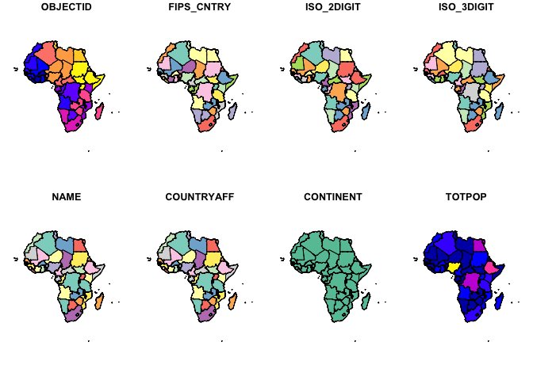
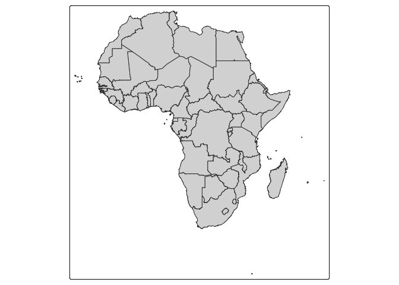
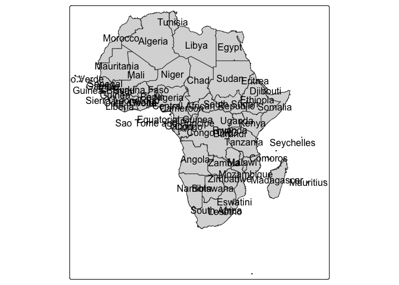
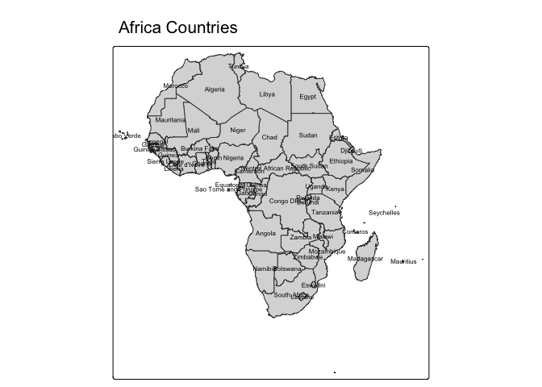
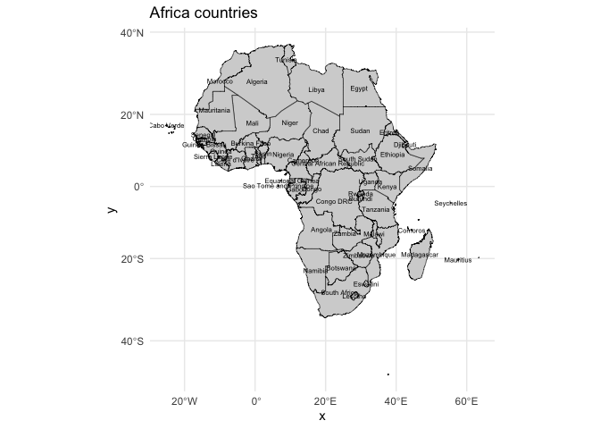
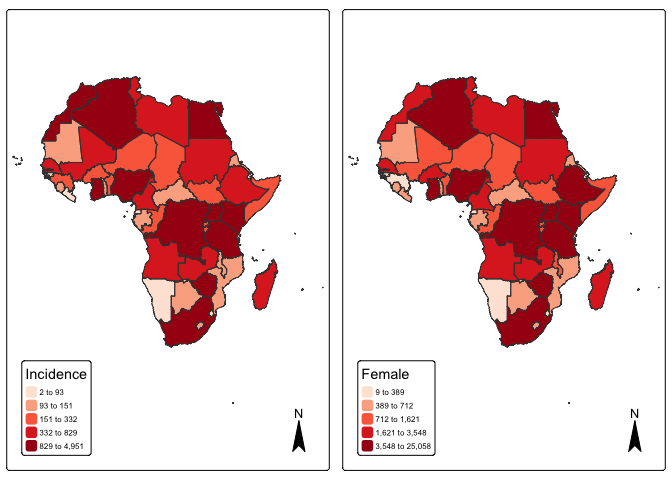

<!-- README.md is generated from README.Rmd. Please edit that file -->

# mlspatial

<!-- badges: start -->

<!-- badges: end -->

The goal of mlspatial is to …

## Installation

You can install the development version of mlspatial from
[GitHub](https://github.com/) with:

``` r
# install.packages("mlspatial")
mlspatial::mlspatial("azizadeboye/mlspatial")
```

## Example

This is a basic example which shows you how to solve a common problem:

``` r
library(mlspatial)
#> Loading required package: tidyverse
#> ── Attaching core tidyverse packages ──────────────────────── tidyverse 2.0.0 ──
#> ✔ dplyr     1.1.4     ✔ readr     2.1.5
#> ✔ forcats   1.0.0     ✔ stringr   1.5.1
#> ✔ ggplot2   3.5.2     ✔ tibble    3.3.0
#> ✔ lubridate 1.9.4     ✔ tidyr     1.3.1
#> ✔ purrr     1.0.4     
#> ── Conflicts ────────────────────────────────────────── tidyverse_conflicts() ──
#> ✖ dplyr::filter() masks stats::filter()
#> ✖ dplyr::lag()    masks stats::lag()
#> ℹ Use the conflicted package (<http://conflicted.r-lib.org/>) to force all conflicts to become errors
## basic example code
```

What is special about using `README.Rmd` instead of just `README.md`?
You can include R chunks like so:

``` r
knitr::opts_chunk$set(echo = TRUE, message = FALSE, warning = FALSE)
library(mlspatial)
library(dplyr)
library(ggplot2)
library(tmap)
library(sf)
#> Linking to GEOS 3.13.0, GDAL 3.8.5, PROJ 9.5.1; sf_use_s2() is TRUE
library(spdep)
#> Loading required package: spData
#> To access larger datasets in this package, install the spDataLarge
#> package with: `install.packages('spDataLarge',
#> repos='https://nowosad.github.io/drat/', type='source')`
library(rgeoda)
#> Loading required package: digest
#> 
#> Attaching package: 'rgeoda'
#> The following object is masked from 'package:spdep':
#> 
#>     skater
library(gstat)
library(randomForest)
#> randomForest 4.7-1.2
#> Type rfNews() to see new features/changes/bug fixes.
#> 
#> Attaching package: 'randomForest'
#> The following object is masked from 'package:dplyr':
#> 
#>     combine
#> The following object is masked from 'package:ggplot2':
#> 
#>     margin
library(xgboost) 
#> 
#> Attaching package: 'xgboost'
#> The following object is masked from 'package:dplyr':
#> 
#>     slice
library(e1071) 
library(caret)
#> Loading required package: lattice
#> 
#> Attaching package: 'caret'
#> The following object is masked from 'package:purrr':
#> 
#>     lift
```



``` r
# Join data
mapdata <- join_data(africa_shp, panc_incidence, by = "NAME")


## OR Joining/ merging my data and shapefiles
mapdata <- inner_join(africa_shp, panc_incidence, by = "NAME")   
## OR mapdata <- left_join(nat, codata, by = "DISTRICT_N")
str(mapdata)
#> Classes 'sf' and 'data.frame':   53 obs. of  26 variables:
#>  $ OBJECTID  : int  2 3 5 6 7 8 9 10 11 12 ...
#>  $ FIPS_CNTRY: chr  "UV" "CV" "GA" "GH" ...
#>  $ ISO_2DIGIT: chr  "BF" "CV" "GM" "GH" ...
#>  $ ISO_3DIGIT: chr  "BFA" "CPV" "GMB" "GHA" ...
#>  $ NAME      : chr  "Burkina Faso" "Cabo Verde" "Gambia" "Ghana" ...
#>  $ COUNTRYAFF: chr  "Burkina Faso" "Cabo Verde" "Gambia" "Ghana" ...
#>  $ CONTINENT : chr  "Africa" "Africa" "Africa" "Africa" ...
#>  $ TOTPOP    : int  20107509 560899 2051363 27499924 12413867 1792338 4689021 17885245 3758571 33986655 ...
#>  $ incidence : num  330.4 53.4 31.4 856.3 163.1 ...
#>  $ female    : num  1683 362 140 4566 375 ...
#>  $ male      : num  1869 211 197 4640 1378 ...
#>  $ ageb      : num  669.7 93.7 68.7 2047 336.7 ...
#>  $ agec      : num  2878 480 268 7147 1414 ...
#>  $ agea      : num  4.597 0.265 0.718 11.888 2.13 ...
#>  $ fageb     : num  250.3 40.2 23.1 782 59.1 ...
#>  $ fagec     : num  1429 322 116 3775 315 ...
#>  $ fagea     : num  3.413 0.146 0.548 8.816 1.228 ...
#>  $ mageb     : num  419.5 53.5 45.6 1265 277.6 ...
#>  $ magec     : num  1448 158 152 3372 1100 ...
#>  $ magea     : num  1.184 0.12 0.17 3.073 0.902 ...
#>  $ yra       : num  182.4 30.2 16.6 524.7 73.1 ...
#>  $ yrb       : num  187.2 34.1 17.1 552.6 74.9 ...
#>  $ yrc       : num  193.1 35 18 578.5 76.9 ...
#>  $ yrd       : num  198.5 35.9 18.3 602.7 78.6 ...
#>  $ yre       : num  204.3 36.5 18.7 621.5 79.4 ...
#>  $ geometry  :sfc_MULTIPOLYGON of length 53; first list element: List of 1
#>   ..$ :List of 1
#>   .. ..$ : num [1:317, 1:2] 102188 90385 80645 74151 70224 ...
#>   ..- attr(*, "class")= chr [1:3] "XY" "MULTIPOLYGON" "sfg"
#>  - attr(*, "sf_column")= chr "geometry"
#>  - attr(*, "agr")= Factor w/ 3 levels "constant","aggregate",..: NA NA NA NA NA NA NA NA NA NA ...
#>   ..- attr(*, "names")= chr [1:25] "OBJECTID" "FIPS_CNTRY" "ISO_2DIGIT" "ISO_3DIGIT" ...
```

``` r
#Visualize Pancreatic cancer Incidence by countries
#Basic map with labels
# quantile map
p1 <- tm_shape(mapdata) + 
  tm_fill("incidence", fill.scale =tm_scale_intervals(values = "brewer.reds", style = "quantile"), 
          fill.legend = tm_legend(title = "Incidence")) + tm_borders(fill_alpha = .3) + tm_compass() + 
  tm_layout(legend.text.size = 0.5, legend.position = c("left", "bottom"), frame = TRUE, component.autoscale = FALSE)
p2 <- tm_shape(mapdata) + 
  tm_fill("female", fill.scale =tm_scale_intervals(values = "brewer.reds", style = "quantile"), 
          fill.legend = tm_legend(title = "Female")) + tm_borders(fill_alpha = .3) + tm_compass() + 
  tm_layout(legend.text.size = 0.5, legend.position = c("left", "bottom"), frame = TRUE, component.autoscale = FALSE)

current.mode <- tmap_mode("plot")
tmap_arrange(p1, p2, widths = c(.75, .75))
```



``` r
tmap_mode(current.mode)
```
